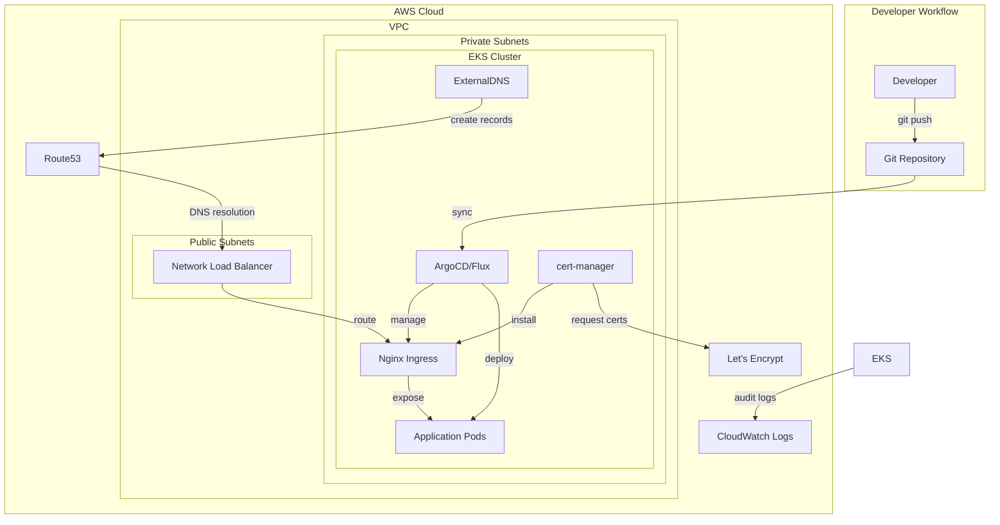
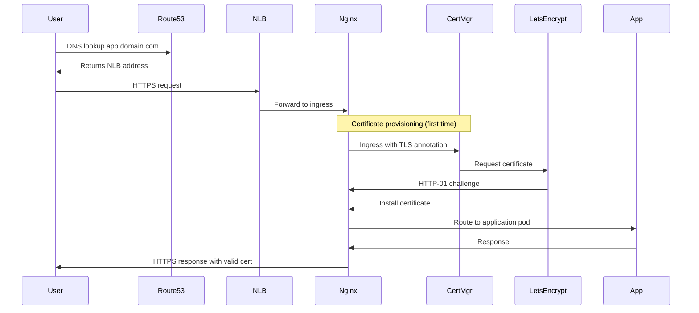

# EKS GitOps Platform - Design Document

## Overview

This design document outlines the architecture and implementation approach for a production-ready EKS platform that demonstrates platform engineering expertise. The platform leverages GitOps principles, infrastructure as code, and cloud-native tooling to provide a self-service deployment environment with automated DNS, TLS, and application lifecycle management.

The platform is designed to be portfolio-worthy, showcasing skills in Kubernetes, AWS, IaC, GitOps, and security best practices that are highly valued in DevOps and platform engineering roles.

## Architecture

### High-Level Architecture



### Technology Stack Selection

**Infrastructure Provisioning: Terraform**
- Chosen over eksctl for better state management and broader AWS resource support
- Enables management of VPC, IAM, Route53, and other AWS resources alongside EKS
- Industry-standard tool that demonstrates IaC proficiency

**GitOps Controller: ArgoCD**
- Chosen over Flux for its superior UI/dashboard (better for portfolio demonstration)
- Provides visual representation of sync status and application health
- Strong Helm integration and multi-tenancy support
- More intuitive for showcasing GitOps workflows to potential employers

**Certificate Management: cert-manager with Let's Encrypt**
- Industry-standard solution for Kubernetes certificate automation
- Free certificates suitable for demo/portfolio projects
- Demonstrates understanding of TLS automation

**Ingress: Nginx Ingress Controller**
- Most widely adopted ingress controller in the industry
- Robust feature set and excellent documentation
- AWS NLB integration for production-grade load balancing

## Components and Interfaces

### 1. Infrastructure Layer (Terraform)

**Purpose**: Provision and manage all AWS infrastructure required for the EKS platform

**Components**:
- **VPC Module**: Creates VPC with public/private subnets across 3 AZs
- **EKS Module**: Provisions EKS control plane and managed node groups
- **IAM Module**: Creates roles and policies for cluster and workload access
- **Route53 Module**: Manages hosted zone for platform DNS

**Key Files Structure**:
```
terraform/
├── main.tf                 # Root module composition
├── variables.tf            # Input variables
├── outputs.tf              # Cluster connection details
├── versions.tf             # Provider versions
├── modules/
│   ├── vpc/               # VPC and networking
│   ├── eks/               # EKS cluster configuration
│   ├── iam/               # IAM roles and policies
│   └── route53/           # DNS hosted zone
└── environments/
    └── dev/               # Environment-specific values
        └── terraform.tfvars
```

**Interfaces**:
- Input: Variable files (terraform.tfvars)
- Output: Kubeconfig, cluster endpoint, OIDC provider ARN
- State: S3 backend for remote state storage

**Design Decisions**:
- Use EKS managed node groups for simplified node lifecycle management
- Implement private subnets for worker nodes with NAT gateway for egress
- Enable EKS cluster encryption using AWS KMS
- Configure VPC CNI for pod networking with custom CIDR blocks

### 2. GitOps Layer (ArgoCD)

**Purpose**: Automate application deployment and cluster configuration through Git-based workflows

**Components**:
- **ArgoCD Server**: Web UI and API server
- **Application Controller**: Monitors Git repos and syncs cluster state
- **Repo Server**: Generates Kubernetes manifests from Git sources
- **Redis**: Caching layer for improved performance

**Deployment Approach**:
- Install ArgoCD using official Helm chart
- Configure via declarative Application and AppProject CRDs
- Implement "App of Apps" pattern for managing multiple applications

**Key Configuration**:
```yaml
# argocd-apps/platform-apps.yaml
apiVersion: argoproj.io/v1alpha1
kind: Application
metadata:
  name: platform-components
spec:
  project: default
  source:
    repoURL: https://github.com/[username]/eks-gitops-platform
    targetRevision: main
    path: kubernetes/platform
  destination:
    server: https://kubernetes.default.svc
    namespace: platform
  syncPolicy:
    automated:
      prune: true
      selfHeal: true
```

**Interfaces**:
- Input: Git repository with Kubernetes manifests and Helm charts
- Output: Deployed applications and platform components
- UI: Web dashboard on ingress endpoint (argocd.yourdomain.com)

**Design Decisions**:
- Use automated sync with self-heal for platform components
- Implement manual sync for production applications (safety)
- Configure RBAC for multi-user access demonstration
- Enable SSO integration capability (documented but optional)

### 3. Ingress Layer (Nginx + cert-manager)

**Purpose**: Provide HTTP/HTTPS routing and automatic TLS certificate management

**Nginx Ingress Controller**:
- Deployed via Helm chart in `ingress-nginx` namespace
- Configured with AWS NLB annotations for L4 load balancing
- Enables proxy protocol for client IP preservation

**cert-manager**:
- Deployed via Helm chart in `cert-manager` namespace
- Configured with ClusterIssuer for Let's Encrypt (staging and production)
- Uses HTTP-01 challenge for certificate validation

**Integration Flow**:


**Key Configuration**:
```yaml
# ClusterIssuer for Let's Encrypt
apiVersion: cert-manager.io/v1
kind: ClusterIssuer
metadata:
  name: letsencrypt-prod
spec:
  acme:
    server: https://acme-v02.api.letsencrypt.org/directory
    email: your-email@example.com
    privateKeySecretRef:
      name: letsencrypt-prod
    solvers:
    - http01:
        ingress:
          class: nginx
```

**Design Decisions**:
- Use NLB instead of ALB for better performance and lower cost
- Configure rate limiting and connection limits for security
- Enable HSTS headers for enhanced security
- Implement redirect from HTTP to HTTPS

### 4. DNS Layer (ExternalDNS)

**Purpose**: Automatically manage Route53 DNS records based on Kubernetes ingress resources

**Components**:
- ExternalDNS controller deployed via Helm
- IAM role for service account (IRSA) for Route53 access
- Watches ingress resources for hostname annotations

**Configuration**:
```yaml
# ExternalDNS Helm values
provider: aws
sources:
  - ingress
domainFilters:
  - yourdomain.com
policy: sync  # Creates and deletes records
txtOwnerId: eks-gitops-platform
serviceAccount:
  annotations:
    eks.amazonaws.com/role-arn: arn:aws:iam::ACCOUNT:role/external-dns
```

**Interfaces**:
- Input: Kubernetes ingress resources with hostname annotations
- Output: Route53 A/CNAME records
- Permissions: IAM role with Route53 write access

**Design Decisions**:
- Use TXT records for ownership tracking
- Implement domain filters to prevent accidental record creation
- Configure sync policy for automatic cleanup
- Enable dry-run mode for initial testing

### 5. Application Layer (Helm Charts)

**Purpose**: Package and deploy sample applications demonstrating platform capabilities

**Sample Applications**:
1. **Hello World App**: Simple web service demonstrating basic deployment
2. **Multi-tier App**: Frontend + backend + database showing service mesh
3. **Monitoring Stack**: Prometheus + Grafana for observability

**Helm Chart Structure**:
```
helm-charts/
├── hello-world/
│   ├── Chart.yaml
│   ├── values.yaml
│   ├── templates/
│   │   ├── deployment.yaml
│   │   ├── service.yaml
│   │   ├── ingress.yaml
│   │   └── serviceaccount.yaml
└── multi-tier-app/
    └── ...
```

**GitOps Integration**:
- Charts stored in Git repository
- ArgoCD Application resources reference chart paths
- Values overrides managed through Git

## Data Models

### Terraform State Schema

**VPC Configuration**:
```hcl
vpc_cidr = "10.0.0.0/16"
availability_zones = ["us-east-1a", "us-east-1b", "us-east-1c"]
private_subnets = ["10.0.1.0/24", "10.0.2.0/24", "10.0.3.0/24"]
public_subnets = ["10.0.101.0/24", "10.0.102.0/24", "10.0.103.0/24"]
```

**EKS Cluster Configuration**:
```hcl
cluster_name = "eks-gitops-platform"
cluster_version = "1.28"
node_groups = {
  general = {
    desired_size = 2
    min_size     = 1
    max_size     = 4
    instance_types = ["t3.medium"]
  }
}
```

### ArgoCD Application Manifest

```yaml
apiVersion: argoproj.io/v1alpha1
kind: Application
metadata:
  name: sample-app
  namespace: argocd
spec:
  project: default
  source:
    repoURL: https://github.com/[username]/eks-gitops-platform
    targetRevision: main
    path: helm-charts/hello-world
    helm:
      values: |
        image:
          repository: nginx
          tag: "1.25"
        ingress:
          enabled: true
          hostname: hello.yourdomain.com
          tls: true
  destination:
    server: https://kubernetes.default.svc
    namespace: applications
  syncPolicy:
    automated:
      prune: true
      selfHeal: true
    syncOptions:
      - CreateNamespace=true
```

### Ingress Resource Schema

```yaml
apiVersion: networking.k8s.io/v1
kind: Ingress
metadata:
  name: app-ingress
  annotations:
    cert-manager.io/cluster-issuer: "letsencrypt-prod"
    external-dns.alpha.kubernetes.io/hostname: "app.yourdomain.com"
    nginx.ingress.kubernetes.io/force-ssl-redirect: "true"
spec:
  ingressClassName: nginx
  tls:
  - hosts:
    - app.yourdomain.com
    secretName: app-tls-cert
  rules:
  - host: app.yourdomain.com
    http:
      paths:
      - path: /
        pathType: Prefix
        backend:
          service:
            name: app-service
            port:
              number: 80
```

## Error Handling

### Infrastructure Provisioning Errors

**Scenario**: Terraform apply fails due to AWS quota limits
- **Detection**: Terraform error output during apply
- **Handling**: Implement pre-flight checks in Makefile/scripts
- **Recovery**: Document quota increase process, provide alternative instance types

**Scenario**: EKS cluster creation timeout
- **Detection**: Terraform timeout after 30 minutes
- **Handling**: Increase timeout values, check AWS service health
- **Recovery**: Destroy partial resources and retry

### GitOps Sync Errors

**Scenario**: ArgoCD cannot sync due to invalid manifest
- **Detection**: ArgoCD reports "OutOfSync" with error message
- **Handling**: ArgoCD maintains previous stable state
- **Recovery**: Fix manifest in Git, ArgoCD auto-retries

**Scenario**: Helm chart deployment fails
- **Detection**: ArgoCD shows degraded health status
- **Handling**: Rollback to previous revision
- **Recovery**: Debug using ArgoCD UI logs, fix chart, re-sync

### Certificate Provisioning Errors

**Scenario**: Let's Encrypt rate limit exceeded
- **Detection**: cert-manager logs show rate limit error
- **Handling**: Use staging issuer for testing
- **Recovery**: Wait for rate limit reset (1 week), use staging certs temporarily

**Scenario**: HTTP-01 challenge fails
- **Detection**: Certificate remains in "pending" state
- **Handling**: Check ingress controller logs and DNS resolution
- **Recovery**: Verify NLB is accessible, check security groups

### DNS Management Errors

**Scenario**: ExternalDNS cannot create Route53 records
- **Detection**: ExternalDNS logs show permission errors
- **Handling**: Verify IAM role and IRSA configuration
- **Recovery**: Update IAM policy, restart ExternalDNS pod

**Scenario**: DNS propagation delay
- **Detection**: Domain not resolving after record creation
- **Handling**: Expected behavior, wait up to 5 minutes
- **Recovery**: Use `dig` or `nslookup` to verify propagation

## Testing Strategy

### Infrastructure Testing

**Terraform Validation**:
- Run `terraform validate` in CI pipeline
- Use `terraform plan` to preview changes before apply
- Implement `tflint` for best practices validation
- Use `checkov` for security scanning

**Manual Verification**:
- Verify EKS cluster is accessible via kubectl
- Confirm node groups are healthy and ready
- Check VPC networking and subnet configuration
- Validate IAM roles and policies are created

### Platform Component Testing

**ArgoCD Validation**:
- Deploy test application via ArgoCD
- Verify automatic sync functionality
- Test manual sync and rollback operations
- Confirm UI is accessible via ingress

**Ingress Testing**:
- Deploy sample application with ingress
- Verify HTTP to HTTPS redirect
- Confirm TLS certificate is valid
- Test multiple ingress rules and path-based routing

**DNS Testing**:
- Create ingress with hostname annotation
- Verify Route53 record is created within 2 minutes
- Test DNS resolution from external client
- Confirm record cleanup when ingress is deleted

**Certificate Testing**:
- Use Let's Encrypt staging for initial tests
- Verify certificate is issued within 5 minutes
- Check certificate details (issuer, expiry, SAN)
- Test automatic renewal (reduce renewal threshold for testing)

### Application Deployment Testing

**Sample Application Tests**:
- Deploy hello-world app via GitOps
- Verify application is accessible via HTTPS
- Test application updates through Git commits
- Confirm automatic sync and deployment

**End-to-End Workflow**:
1. Push application manifest to Git
2. Verify ArgoCD detects change
3. Confirm application deploys successfully
4. Check DNS record is created
5. Verify TLS certificate is provisioned
6. Access application via HTTPS URL
7. Validate application functionality

### Security Testing

**Network Policy Testing**:
- Deploy network policies
- Verify pod-to-pod communication restrictions
- Test allowed and denied traffic flows

**IRSA Testing**:
- Verify service accounts have correct IAM role annotations
- Test AWS API access from pods
- Confirm least-privilege access

**Audit Log Verification**:
- Check CloudWatch for cluster audit logs
- Verify API server requests are logged
- Confirm log retention settings

### Documentation Testing

**Setup Verification**:
- Follow README instructions on clean environment
- Document any missing steps or unclear instructions
- Verify all commands execute successfully
- Confirm expected outcomes match documentation

**Cleanup Testing**:
- Execute cleanup/destroy procedures
- Verify all AWS resources are removed
- Check for any orphaned resources
- Confirm no unexpected costs

## Security Considerations

### Network Security

- Worker nodes in private subnets with no direct internet access
- NAT Gateway for outbound internet connectivity
- Security groups with least-privilege rules
- Network policies for pod-to-pod communication control

### Identity and Access Management

- IRSA (IAM Roles for Service Accounts) for AWS service access
- Separate IAM roles for each component (ExternalDNS, cert-manager, etc.)
- No long-lived AWS credentials stored in cluster
- EKS cluster IAM role with minimal required permissions

### Data Protection

- EKS cluster encryption at rest using AWS KMS
- Secrets encrypted in etcd
- TLS for all external communication
- Private container registry (ECR) for custom images

### Audit and Compliance

- EKS audit logging enabled and sent to CloudWatch
- ArgoCD audit logs for deployment tracking
- Git history provides complete audit trail
- Resource tagging for cost allocation and compliance

### Pod Security

- Pod Security Standards enforced (restricted profile)
- Non-root containers where possible
- Read-only root filesystems
- Resource limits and requests defined
- Security context constraints

## Cost Optimization

**Estimated Monthly Cost** (us-east-1):
- EKS Control Plane: $73
- EC2 Instances (2x t3.medium): ~$60
- NAT Gateway: ~$32
- Network Load Balancer: ~$16
- Route53 Hosted Zone: $0.50
- Data Transfer: ~$10
- **Total: ~$191/month**

**Cost Reduction Strategies**:
- Use Spot instances for non-production node groups
- Implement cluster autoscaler for dynamic scaling
- Schedule cluster shutdown during non-demo hours
- Use single NAT gateway instead of one per AZ
- Leverage AWS Free Tier where applicable

**Cleanup Reminder**:
- Document clear destruction procedure
- Implement `make destroy` command
- Verify all resources are removed to avoid ongoing charges

## Implementation Phases

### Phase 1: Infrastructure Foundation
- Set up Terraform project structure
- Create VPC and networking components
- Provision EKS cluster with managed node groups
- Configure kubectl access

### Phase 2: Platform Components
- Install ArgoCD via Helm
- Deploy Nginx Ingress Controller
- Install cert-manager with Let's Encrypt issuer
- Deploy ExternalDNS with Route53 integration

### Phase 3: GitOps Configuration
- Set up Git repository structure
- Create ArgoCD Application manifests
- Implement "App of Apps" pattern
- Configure automated sync policies

### Phase 4: Sample Applications
- Create Helm charts for demo applications
- Deploy hello-world application
- Implement multi-tier application example
- Add monitoring stack (optional)

### Phase 5: Documentation and Polish
- Write comprehensive README
- Create architecture diagrams
- Document setup and teardown procedures
- Add troubleshooting guide
- Record demo video (optional)

## Repository Structure

```
eks-gitops-platform/
├── README.md                          # Main documentation
├── ARCHITECTURE.md                    # Detailed architecture
├── Makefile                           # Common commands
├── terraform/                         # Infrastructure as Code
│   ├── main.tf
│   ├── variables.tf
│   ├── outputs.tf
│   ├── modules/
│   └── environments/
├── kubernetes/                        # Kubernetes manifests
│   ├── platform/                      # Platform components
│   │   ├── argocd/
│   │   ├── ingress-nginx/
│   │   ├── cert-manager/
│   │   └── external-dns/
│   └── argocd-apps/                   # ArgoCD Application definitions
├── helm-charts/                       # Custom Helm charts
│   ├── hello-world/
│   └── multi-tier-app/
├── docs/                              # Additional documentation
│   ├── setup-guide.md
│   ├── troubleshooting.md
│   └── diagrams/
└── scripts/                           # Utility scripts
    ├── setup.sh
    └── cleanup.sh
```

This design provides a solid foundation for implementing a production-ready EKS platform that effectively demonstrates platform engineering skills while remaining practical for a portfolio project.
